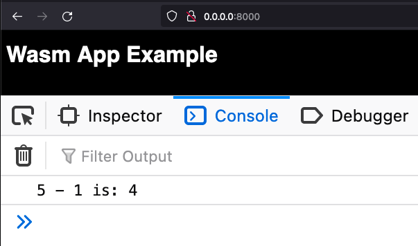
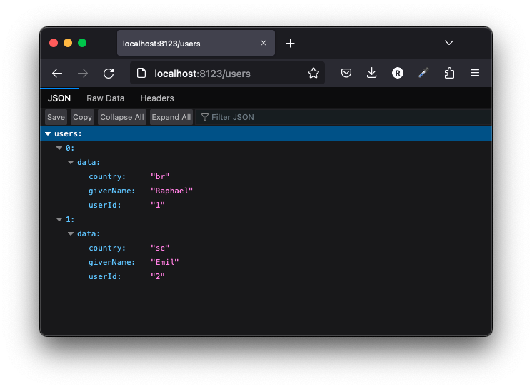

# cargo-server

> tl;dr: Does the same as "python -m http.server" or "npx serve" but for Rust ecosystem and with few more functionalities.

`cargo-server` helps you serve a static site, single page application or just a static file (no matter if on your device or on the local network). It also provides a neat interface for listing the directory's contents.

You can use cargo to install:

```bash
cargo install cargo-server
```

With cargo-binstall:

```bash
cargo binstall cargo-server
```

Once `cargo-server` is installed, you can run this command inside your project's directory. It will create by default in `8000` port:

```bash
cargo server
```

## --port

To specify the port, you can use `--port`:

```bash
cargo server --port 3000
```

## --open

To open in your browser after run the command just add `--open`:

```bash
cargo server --open
```

## --path

You can also set a custom path using `--path`:

```bash
cargo server --path ./examples/simple-wasm-frontend-app
```

Result:



## --quiet

Is also possible to run without any stdout using `--quiet`:

```bash
cargo server --quiet --open --path ./examples/simple-wasm-frontend-app
```

## --route

You can create custom routes that returns JSON

#### `--json` with params

```bash
cargo server \
	--route '/users/:userId' \
	--json '{"data":{"userId":"{!0}","givenName":"Raphael","country":"br"}}' \
	--port 8123
```

Result:



#### `--json` without params

```bash
cargo server \
	--route '/users' \
	--json '{"users":[{"data":{"userId":"3","givenName":"Raphael","country":"br"}}]}' \
	--port 8123
```

Result:


## --ngnix

In progress...

