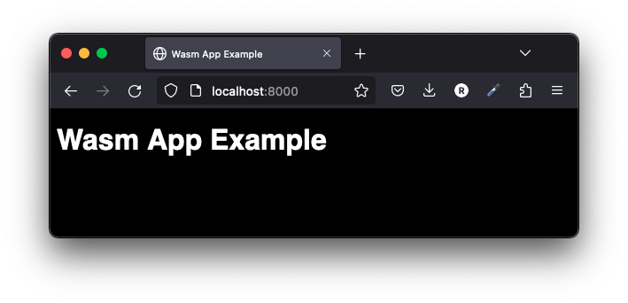

# cargo-server

`cargo-server` helps you serve a static site, single page application or just a static file (no matter if on your device or on the local network). It also provides a neat interface for listing the directory's contents.

Pre-built binaries are available on the [Github Releases tab](https://github.com/raphamorim/cargo-server/releases).

You can use cargo to install:

```
$ cargo install cargo-server
```

With cargo-binstall:

```sh
$ cargo binstall cargo-server
```

## Quick example


Once `cargo-server` is installed, you can run this command inside your project's directory. It will create by default in `8000` port:

```
$ cargo server
```

To specify the port, you can use `--port`:

```
$ cargo server --port 3000
```

To open in your browser after run the command just add `--open`:

```
$ cargo server --open
```

You can also set a custom path using `--path`:

```
$ cargo server --path /Users/raphamorim/Documents/simple-wasm-frontend-app
```

Also is possible to run without any stdout using `--quiet`:

```
$ cargo server --quiet --open --path /Users/raphamorim/Documents/simple-wasm-frontend-app
```

Result:


